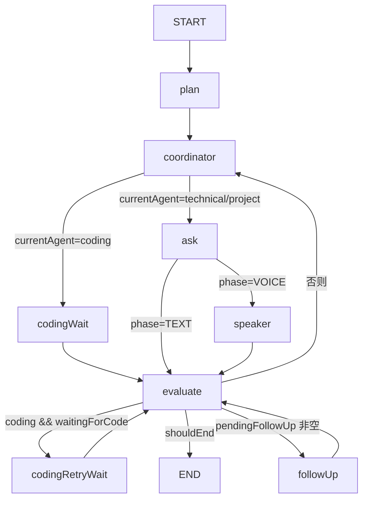

# 02 系统架构与 Agent 架构详解（核心）

> 知识库入口：[00-知识库索引.md](00-知识库索引.md) ｜ 上一篇：[01-项目概览与目录结构.md](01-项目概览与目录结构.md) ｜ 下一篇：[03-功能模块实现详解.md](03-功能模块实现详解.md)

---

## 1. 系统架构总览

### 1.1 端到端交互流程

```
[前端 Vue3]                        [后端 Spring Boot]
    │ 注册/登录 (JWT)                    │ AuthController/AuthService
    │ 上传简历 (Tika 解析)               │ ResumeService
    ▼                                   ▼
    │ POST /api/interviews/start (SSE)   │ InterviewService.startInterview
    │      ┌─────────────────────────────────────────────┐
    │      │ 异步线程池 interviewExecutor 内执行：        │
    │      │ 1. 生成面试计划 (PlanGenerator)              │
    │      │ 2. 执行 StateGraph (InterviewGraphBuilder)   │
    │      │ 3. 节点间通过 AskQuestionTool 阻塞等待回答   │
    │      │ 4. EvaluateNode 评分/落库/更新知识点          │
    │      │ 5. 完成后生成报告 + SSE 推送                  │
    │      └─────────────────────────────────────────────┘
    │ ←SSE: CONNECTED/THINKING/QUESTION/FOLLOW_UP/WAITING_CODE/REPORT_READY/COMPLETE/ERROR
    │ POST /api/interviews/{id}/answer   │ AskQuestionTool.submitAnswer（唤醒阻塞）
    │ POST /api/coding/submit/{id}       │ CodingSubmitController → resumeCoding（恢复图）
    │ GET  /api/interviews/sessions/{id}/report │ 报告查询
```

### 1.2 面试会话状态机

`interview_session.status` 字段：

```
planned ──→ in_progress ──→ waiting_code（编程题挂起，提交代码后回到 in_progress）
                │   │
                │   ├──→ completed（轮次跑满，报告生成）
                │   └──→ interrupted（手动结束 / 异常）
```

### 1.3 SSE 事件协议

| 事件名 | 触发方 | 说明 |
|:---|:---|:---|
| `CONNECTED` | start | 会话已创建，携带 sessionId |
| `THINKING` | AskNode/FollowUpNode | 面试官思考中 |
| `QUESTION` | AskNode | 新题目（JSON：`{questionNumber, question, isFollowUp}`） |
| `FOLLOW_UP` | FollowUpNode | 追问（题号沿用所属主轮） |
| `WAITING_CODE` | InterviewService | 编程题已出 / 代码不达标需重试（带提示） |
| `CODE_SUBMITTED` | CodingSubmitController | 代码已提交，评估中 |
| `REPORT_READY` | ReportGenerator | 报告已生成（data 为报告 JSON） |
| `COMPLETE` | InterviewService | 面试结束 |
| `ERROR` | 异常处理 | 面试执行失败 |

---

## 2. Agent 架构详解

### 2.1 图结构

见 [InterviewGraphBuilder.java](../src/main/java/com/interview/agent/interview/graph/InterviewGraphBuilder.java)。编译后的 StateGraph 结构：



**关键设计点：**

1. **领域状态整体存放**：`InterviewState` 作为单一 key（`STATE_KEY = "interviewState"`）存入 `OverAllState`；全部 key 使用 `ReplaceStrategy`（覆盖策略）。
2. **Checkpoint 持久化**：`MysqlSaver` + `threadId = sessionId`，每个 checkpoint 落库 MySQL（`GRAPH_CHECKPOINT` / `GRAPH_THREAD` 表由 MysqlSaver 自动创建）。
3. **恢复兼容**：checkpoint 反序列化时 `InterviewState` 可能变成 `Map`，`toInterviewState()` 用 Jackson `convertValue` 兜底转换。
4. **递归上限**：`recursionLimit(50)`，防止无限循环。
5. **挂起节点**：`interruptBefore("codingWait", "codingRetryWait")`——图执行到这两个节点**之前**挂起，checkpoint 落库后线程返回；提交代码后 `resume()` 继续。
6. **观测上下文注入**：所有节点统一包 `withTraceContext(NodeAction)`——在节点执行线程内从 `InterviewState` 取 sessionId 写入 `LlmTraceContextHolder`（节点跑在图自己的线程池，ThreadLocal 无法自动继承），保证节点内的 LLM 调用能归因到会话（见 03 文档第 15 节）。

### 2.2 节点职责

| 节点 | 实现类 | 职责 |
|:---|:---|:---|
| `plan` | PlanNode | 已有计划则直接应用 maxRounds；否则调用 PlanGenerator 生成计划并回填（计划 `estimatedTotalRounds` 作为 maxRounds，取代默认 20） |
| `coordinator` | CoordinatorNode | ① CoordinatorAgent（qwen-turbo）决策下一个 Agent / 主题 / 难度（含“已考察主题”强约束）；② **编程题确定性护栏**（见 2.4）；③ **知识库检索注入**（挂载知识库时按 topic 检索 top3 片段注入出题 prompt）；④ 调用对应 Agent 出题；⑤ 去重重试（最多 3 次）；⑥ 路由到 coding 时置 `waitingForCode=true` |
| `ask` | AskNode | 推送 `THINKING` + `QUESTION`（JSON 负载），AskQuestionTool 阻塞等待回答（30 分钟超时），题号 = 非追问轮计数 + 1 |
| `speaker` | SpeakerAgent（占位） | Phase 1 文字面试直接透传原文；Phase 2 数字人启用语音合成 |
| `codingWait` | 内联 lambda | 实际执行时说明代码已提交：重置 `waitingForCode=false`、状态 `in_progress` |
| `codingRetryWait` | 内联 lambda | 修改后代码已提交：重置标志 + `codingRetryCount+1` |
| `evaluate` | EvaluateNode | ① 文本题走 AnswerEvaluator（LLM 真实评分；挂载知识库时按“题目+回答前200字”检索 top3 片段作为评分事实依据注入），编程题走代码评估链路；② 人格调整分数；③ 策略决策（重试/提示/严格度）；④ 编程题重试决策（decideCodingRetry）；⑤ 生成追问；⑥ 记录 RoundRecord + 增量落库；⑦ 更新知识点 |
| `followUp` | FollowUpNode | 推送 `FOLLOW_UP` 追问并等待回答，`isFollowUpRound=true`，评估后重置 |

### 2.3 条件边路由逻辑（evaluate 之后）

```java
if (currentAgent == coding) {
    shouldEnd        → END
    waitingForCode   → codingRetryWait（再次挂起等修改）
    否则             → coordinator（切题）
} else {
    shouldEnd        → END
    非追问轮且有追问内容 → followUp
    否则             → coordinator
}
```

结束条件 `shouldEnd`：`currentRound >= maxRounds`（maxRounds 来自计划）。**注意**：历史上"连续 3 轮达标提前结束"已被移除——文本评分曾用长度启发式导致恒定满分，使面试在编程题后直接终结、候选人感知为"没有进入下一题"（代码注释有详细说明）。

### 2.4 编程题确定性护栏（CoordinatorNode）

LLM 的 coding 路由决策不被信任，强制护栏：

1. **全场最多 1 道编程题**（`codingCount >= 1` 则改派）；
2. **至少先进行 2 轮非编程题**（`currentRound < CODING_MIN_ROUND(2)` 时改派）；
3. **编程题主题强制从算法池选取**：`["数组与字符串","链表","哈希表","栈与队列","二叉树","双指针","排序与二分查找","动态规划"]`——防止"Redis 限流器"这类系统设计题进入代码编辑器；
4. **中后段强制安排**：进入第 3 轮后若还没出过编程题，强制路由到 coding（防止 LLM 一直不出或提前结束跳过编程环节）；
5. **CodingAgent 偏移检测**：出题文本命中系统设计关键词（`Redis/Kafka/分布式/限流/短链...`）→ 加强约束重试一次 → 仍偏移则用算法题库兜底。

### 2.5 Human-in-the-Loop：AskQuestionTool

[AskQuestionTool.java](../src/main/java/com/interview/agent/interview/agent/tool/AskQuestionTool.java) 是图与用户之间的"提问桥梁"：

- `askAndWait()`：① 检查会话是否已终止；② 创建 `CompletableFuture` 放入 `pendingQuestions`；③ **持久化当前题目**到 `interview_session.current_question`（SSE 事件丢失时前端可轮询恢复）；④ SSE 推送题目；⑤ `future.get(30min)` 阻塞等待；⑥ 超时返回占位串"【超时未回答】"（已终止则抛 `InterviewTerminatedException`）。
- `submitAnswer()`：从 pendingQuestions 取出 future 并 `complete(answer)` 唤醒图线程。
- `cancel()`：标记 `terminatedSessions` + 取消 future——手动结束面试时图线程会感知并中断。
- `resetTermination()`：仅面试重新开始时调用。

### 2.6 模型分工与成本控制

| 任务 | 模型 | 说明 |
|:---|:---|:---|
| Coordinator 路由 | qwen-turbo | 便宜、快速，只做结构化决策 |
| 计划/出题/评估/追问/摘要/动态用例/代码评估 | qwen3.7-max-2026-05-17（默认 ChatClient） | 高质量任务；混合思考模型，必须配 `enable-thinking: true`（否则 DashScope 报 400） |
| 知识库向量化/检索 | text-embedding-v3 | 1024 维，写入 Elasticsearch 向量索引 |

所有 LLM 调用的 token 用量与估算成本由观测模块自动采集落 `llm_trace`（见 03 文档第 15 节），可按会话 / Agent 维度汇总，前端观测台可视化。

### 2.7 状态对象 InterviewState 字段速查

| 字段 | 用途 |
|:---|:---|
| `sessionId / userId` | 会话归属（threadId = sessionId） |
| `knowledgeBaseId` | 挂载的知识库 ID（可空；非空时出题/评估环节检索注入） |
| `resumeText / jdText / direction / persona / durationMinutes` | 面试输入 |
| `plan` | 面试计划（InterviewPlan） |
| `currentRound / maxRounds` | 当前轮次 / 总轮次（计划决定） |
| `rounds` | 已完成的轮次记录（RoundRecord：题号/Agent/题目/回答/评估/是否追问/追问目标） |
| `currentQuestion / currentAnswer` | 当前题 / 当前答 |
| `currentAgent` | technical / project / coding |
| `status` | in_progress / completed / interrupted |
| `phase` | TEXT（跳过 speaker）/ VOICE |
| `waitingForCode` | 显式挂起标志（路由到 coding 时置 true，codingWait 执行时重置） |
| `pendingFollowUp / isFollowUpRound` | 追问内容与追问轮标记 |
| `currentLanguage / codingScore / codingRetryCount / codingHint` | 编程题状态（语言/最近评分/重试次数/提示） |

---

*文档结束。如有与代码不一致之处，以代码为准。*
